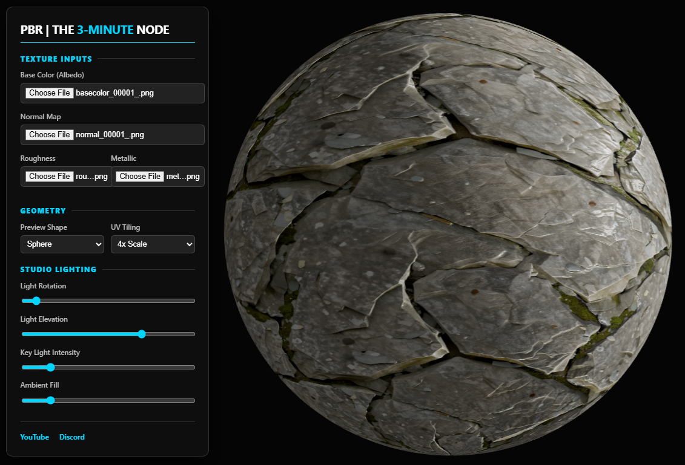

# ⚡ PBR | The 3-Minute Node Viewer

A lightweight, zero-setup **Physically Based Rendering (PBR)** texture viewer built with Three.js. Drop your maps in, adjust your studio lighting, and preview your materials instantly in the browser.

## 🚀 Features

* **Instant Preview:** Load Albedo, Normal, Roughness, and Metallic maps directly from your local drive.
* **Dynamic Geometry:** Switch between sphere and cube primitives to test how light wraps around different surfaces.
* **Studio Lighting Control:** Real-time sliders for Key Light rotation, elevation, intensity, and Ambient Fill.
* **UV Tiling:** Test material repetition with 1x, 2x, 4x, and 8x scale options.
* **High Fidelity:** Uses ACES Filmic tone mapping and anisotropic filtering for professional-grade visual output.

## 🛠️ Tech Stack

* **Three.js** (WebGL Framework)
* **OrbitControls** (Intuitive Camera Navigation)
* **HTML5/CSS3** (Glassmorphism UI)
* **Vanilla JavaScript** (Zero dependencies beyond Three.js)

## 📖 How to Use

1. **Open the App:** Launch the `pbr-viewer.html` file in any modern web browser.
2. **Load Textures:** Use the `Texture Inputs` panel to select your image files.
3. **Adjust Look:**
* **Left Click + Drag** to rotate the camera.
* **Right Click + Drag** to pan.
* **Scroll** to zoom.
4. **Refine Lighting:** Use the `Studio Lighting` sliders to see how your roughness and normal maps react to light at different angles.

## 🌐 Connect

Created by **The 3-Minute Node**. Join our community for more CG tools and tutorials:

* [YouTube](https://www.youtube.com/@The3MinuteNode)
* [Discord](https://discord.gg/wDn7cj68gm)
* [Support Our Mission](https://www.paypal.com/donate/?hosted_button_id=EF3QDPEWK359N)
